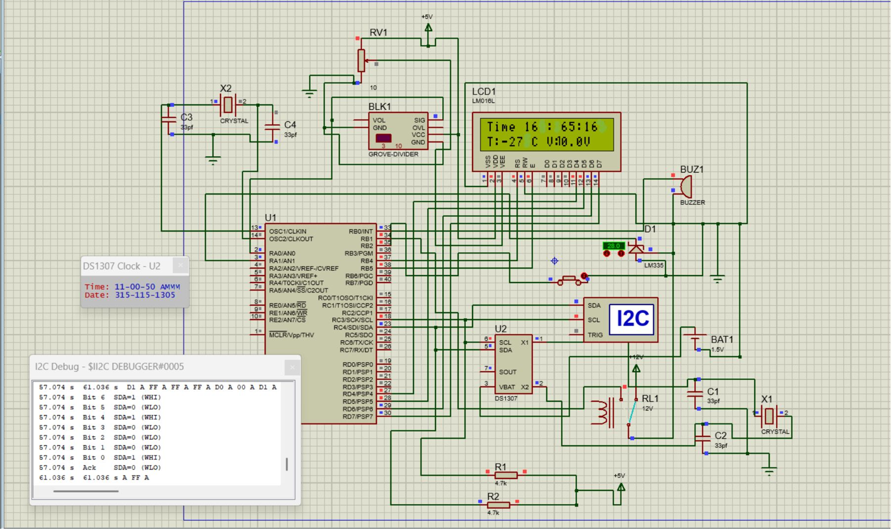

# Automotive Information Console (PIC16F877A)

This project implements a microcontroller-based **vehicle information console** on a 16×2 LCD.  
It monitors **temperature, battery voltage, date/time**, and provides **frost alarm** and **lamp control**.  
Built with **MPLAB X + XC8** and simulated in **Proteus**.

---

## ✨ Features

- **Temperature sensing** (LM335) with frost alarm buzzer
- **Battery voltage monitoring** using ADC
- **Real-Time Clock (DS1307)** with date/time display
- **Lamp relay control** (manual/auto)
- **16×2 LCD display** (4-bit mode)

---

## 📂 Repository Structure

src/ → XC8 firmware source (main.c, headers, etc.)
proteus/ → Proteus project & schematic files (.dsn, .pdsprj)
docs/ → Screenshots, block diagram, LCD demo images

yaml
Copy
Edit

---

## ⚙️ Build Instructions

1. Open `src/` in **MPLAB X IDE**
2. Compile with **XC8 compiler**
3. Generate HEX file (default: `dist/.../production.hex`)

---

## 🖥️ Simulation in Proteus

1. Open `proteus/automotive_info_console.pdsprj`
2. Attach compiled HEX to the PIC16F877A
3. Run simulation

---

## 🔌 Key Connections

- **LM335 → AN1 (RA1)** with 10k bias resistor
- **Battery divider → AN0 (RA0)**
- **DS1307 RTC → SDA=RC4, SCL=RC3** (with 4.7k pull-ups, 32.768 kHz crystal)
- **LCD** → RS=RB4, EN=RB5, D4–D7=RD4–RD7, RW=GND
- **Buzzer** → RB2
- **Relay driver** → RB1

---

## 📸 Demo

  

---

## 📜 License

This project is licensed under the **MIT License** – see [LICENSE](LICENSE) for details.
